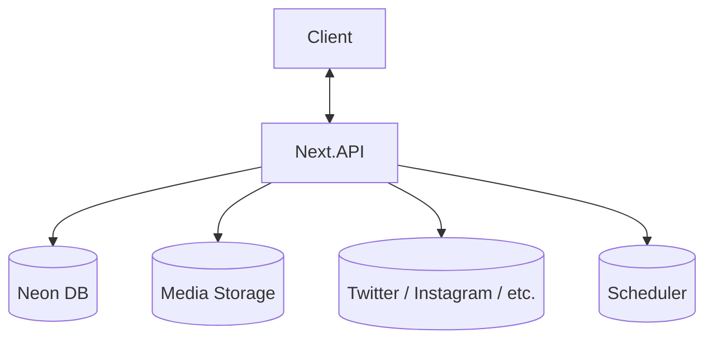
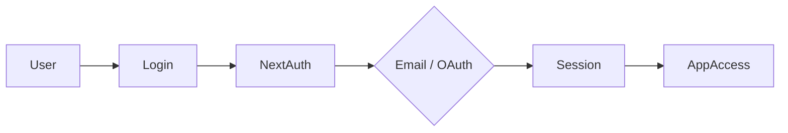

## Social Media Manager — Project Specifications

Centralized Social Media Management Platform

---

## Project Overview

A platform that lets users connect their social media accounts, create and schedule posts, and monitor performance — all from one place.

---

## Problem (Core Idea)

Managing multiple social media accounts is fragmented:

- Posting natively to each platform individually
- No single place to draft and schedule content
- Analytics spread across different platform dashboards
- No way to plan and visualize a content calendar

➡ **This app provides ONE hub to connect accounts, create content, schedule posts, and track analytics.**

---

## Users

| Persona                  | Needs                                                  |
| ------------------------ | ------------------------------------------------------ |
| Solo Creator             | Schedule posts in advance, track engagement            |
| Small Business Owner     | Manage brand accounts across platforms from one place  |
| Social Media Manager     | Handle multiple client accounts, plan content calendar |
| Freelancer / Consultant  | Quick posting and performance overview for clients     |

---

## Core Features

### A) Authentication

- Email + Password signup / login
- OAuth (GitHub or Google — for convenience)
- Session-based access via NextAuth v5

### B) Social Media Account Linking

Connect and manage multiple accounts across platforms:

- Twitter / X
- Instagram
- Facebook
- LinkedIn
- (More platforms added over time via OAuth integrations)

Each linked account stores access tokens securely and can be disconnected at any time.

### C) Post Creation

A dedicated screen to compose posts:

- Write text content
- Attach images or media
- Select one or multiple connected accounts to post to
- Preview per platform

### D) Scheduling & Publishing

- Choose a publish date and time
- Queue posts for automatic publishing
- View scheduled posts in a calendar or list view
- Publish immediately or save as draft

### E) Dashboard & Analytics

An overview page per connected account showing:

- Follower count and growth
- Post reach and impressions
- Engagement (likes, comments, shares, clicks)
- Recent post performance

### F) Additional Features

- Draft saving
- Post history (published, scheduled, failed)
- Dark mode (default)
- Responsive layout for mobile

---

## Data Model (Rough Prisma Draft)

> This schema is a starting point and will evolve

```prisma
model User {
  id            String          @id @default(cuid())
  email         String          @unique
  password      String?
  isPro         Boolean         @default(false)
  accounts      SocialAccount[]
  posts         Post[]
  createdAt     DateTime        @default(now())
  updatedAt     DateTime        @updatedAt
}

model SocialAccount {
  id            String    @id @default(cuid())
  platform      String    // twitter | instagram | facebook | linkedin
  platformId    String
  username      String
  accessToken   String
  refreshToken  String?
  tokenExpiry   DateTime?

  userId        String
  user          User      @relation(fields: [userId], references: [id])

  posts         PostTarget[]
  createdAt     DateTime  @default(now())
}

model Post {
  id            String       @id @default(cuid())
  content       String
  mediaUrls     String[]
  status        String       @default("draft") // draft | scheduled | published | failed
  scheduledAt   DateTime?
  publishedAt   DateTime?

  userId        String
  user          User         @relation(fields: [userId], references: [id])

  targets       PostTarget[]
  createdAt     DateTime     @default(now())
  updatedAt     DateTime     @updatedAt
}

model PostTarget {
  id              String        @id @default(cuid())
  status          String        @default("pending") // pending | published | failed
  platformPostId  String?
  errorMessage    String?

  postId          String
  post            Post          @relation(fields: [postId], references: [id])

  socialAccountId String
  socialAccount   SocialAccount @relation(fields: [socialAccountId], references: [id])
}
```

---

## Tech Stack

| Category      | Choice                          |
| ------------- | ------------------------------- |
| Framework     | **Next.js 16 (React 19)**       |
| Language      | TypeScript                      |
| Database      | Neon PostgreSQL + Prisma ORM    |
| File Storage  | Cloudflare R2                   |
| CSS / UI      | Tailwind CSS v4 + ShadCN        |
| Auth          | NextAuth v5 (email + OAuth)     |
| Job Queue     | (TBD — e.g. Trigger.dev / cron) |
| Deployment    | Vercel                          |
| Monitoring    | Sentry (later)                  |

---

## Monetization

The app launches as **free**. The architecture is designed to support paid tiers in the future without a rewrite.

| Plan  | Price | Limits                              | Features                                          |
| ----- | ----- | ----------------------------------- | ------------------------------------------------- |
| Free  | $0    | 2 connected accounts, 10 scheduled  | Basic scheduling, basic analytics                 |
| Pro   | TBD   | Unlimited accounts & posts          | Advanced analytics, bulk scheduling, priority publishing |

> Stripe integration and plan enforcement to be added when monetization is introduced.

---

## UI / UX

- Dark mode first
- Clean, minimal developer-friendly UI
- Inspired by **Buffer, Later, and Linear**

### Layout

- **Collapsible sidebar** with navigation (Dashboard, Create Post, Schedule, Accounts, Settings)
- Main workspace area
- Analytics cards on dashboard

### Responsive

- Mobile drawer for sidebar
- Touch-optimized controls

---

## API Architecture



---

## Auth Flow



---

## Roadmap

### MVP

- Auth (signup / login)
- Connect social accounts (at least Twitter + one other)
- Create and publish posts
- Basic scheduling
- Dashboard with basic analytics

### Pro Phase

- Advanced analytics (charts, trends)
- Bulk scheduling / CSV import
- Multi-account post targeting
- Billing & upgrade flow (Stripe)

### Future Enhancements

- Content calendar view
- AI caption suggestions
- Team / workspace support
- Browser extension for quick sharing
- Mobile app

---

## Status

- In planning
- Environment setup in progress

---

**Social Media Manager — Plan Once. Post Everywhere.**
